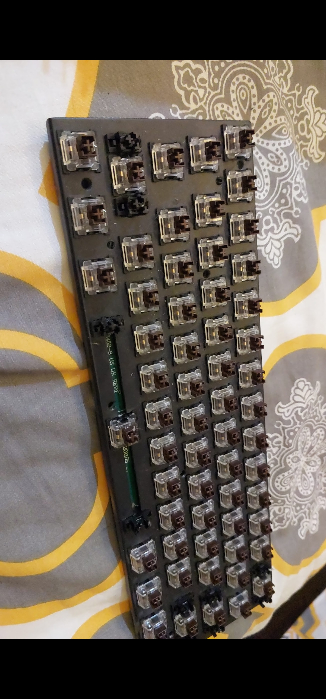
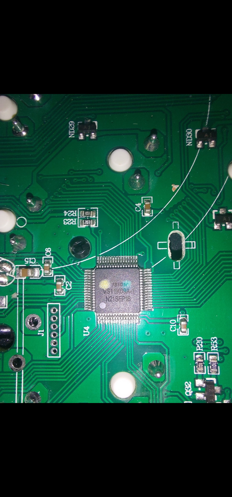
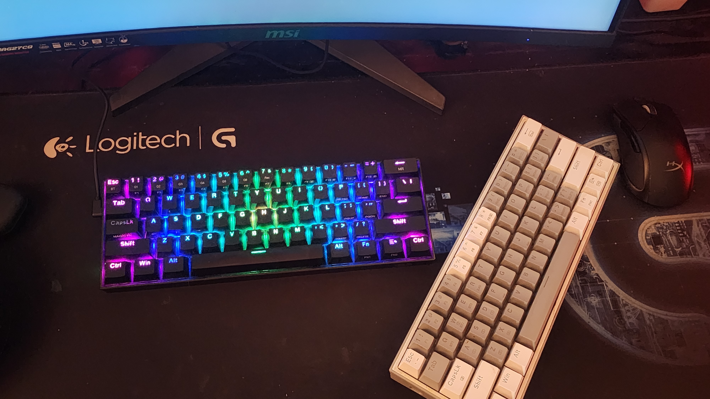

# ⌨️ K530-Firmware-Recovery
### *Hardware-Level Restoration of Corrupted MCU Firmware*

*Figure 1: Teardown of the K530 to access the logic board.*

## 🎯 The Situation
Standard software update tools failed after a corrupted firmware flash, leaving the K530 unbootable and unrecognized by the OS. Local technicians deemed the logic board "unfixable." This project documents the successful recovery using a **First-Principles** engineering approach.

## 🛠️ Execution Roadmap
- [x] **Analyze Hardware:** Identified the MCU and located the physical boot-pins.
- [x] **Datasheet Verification:** Confirmed the Hardware Bootloader Trigger sequence.
- [x] **DFU Injection:** Initiated recovery mode by shorting specific GPIO pins during power-cycle.
- [x] **Firmware Restoration:** Manually flashed the OEM binary via low-level USB-HID interface.
- [x] **Validation:** Restored 100% functionality of the key matrix and RGB controller.

---

## 🕵️‍♂️ Technical Breakdown

### **1. Identifying the Brain (The MCU)**
The first step was identifying the specific controller chip to find its technical manual. 

*Figure 2: The VS11K09A-1 Microcontroller identified on the PCB.*

### **2. The "Unbricking" Logic**
When the application layer of a microcontroller (MCU) is corrupted, it cannot process USB commands. By reading the MCU datasheet, I identified a hardware "backdoor"—the **Bootloader Mode**. 

**Recovery Pin Mapping:**
| Component | Function | Action Taken |
| :--- | :--- | :--- |
| **Microcontroller** | EVision VS11K09A-1 | Identified via visual inspection |
| **Boot-Pins** | Hardware Trigger | Shorted to GND to bypass corrupted OS |
| **USB-HID** | Recovery Path | Forced PC to recognize device in DFU mode |

### **Results**
By forcing the hardware into its native bootloader state, I was able to bypass the "unresponsive" status and push a clean firmware image directly to the chip's memory.

*Figure 3: Final reassembly and aesthetic validation of the restored K530.*

---

## 📚 Resources & Links
* **MCU Datasheet:** https://github.com/SonixQMK/Mechanical-Keyboard-Database/blob/main/docs/MCU%20chip/VS11K09A-1.pdf
* **Flashing Tool:** https://kmovetech.com/DIERYA%20&%20Kemove%20Wired%20mode%20firmware%20update.rar

## 📜 License
This project is licensed under the **MIT License**.

*Resurrected by **Aoun Raza***
